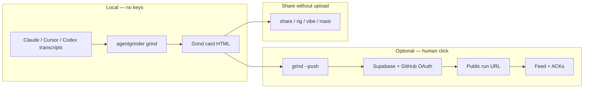

# DEVPOST-READY · Agent Grinder · PRODUCT (not primary submission)

> **NOT the Sep 14 Devpost submission.** Primary entry: [Morkeeth/agents-for-humans](https://github.com/Morkeeth/agents-for-humans) (**MAGNET**).  
> Grinder is the social/distribution layer. Use this doc for post-hackathon launch or a second entry only if substantially different.

**Event context:** [Agents for Humans](https://agentsforhumans.devpost.com/) · deadline Sep 14 2026 5pm PDT · $40K

---

## Tagline (≤60 chars)

**Where you post your real agent runs — honest by construction**

(59 chars)

---

## One-liner + constraint

**One-liner:** Strava for coding-agent sessions — one command turns a real sitting into a card you'd share; friends ACK the work, steal your rig, roast your shape.

**Constraint:** Every metric traces to the session log. `47 prompts` means 47 typed turns were counted, not a vibe. Agents propose; humans publish.

---

## Three screenshots

| # | Path | What it shows |
|---|------|---------------|
| 1 | `docs/shots/six/tonight-light.png` | Solo grind card — grind trace, stats, light mode |
| 2 | `docs/shots/six/SHEET-light.png` | Six-card sheet — variety of session shapes |
| 3 | `docs/shots/nightrun-card-public.png` | Fleet night-run card — multi-agent session route |

**Note:** PNGs are UNSCANNED — human eyeball required before publish (see seed-clean audit).

Generate fresh cards locally:

```bash
bash scripts/pitch-demo.sh
# open /tmp/pitch-grind.html / /tmp/pitch-share.html in browser → screenshot
```

---

## Architecture



**Flow:** Read transcripts locally → render card → (optional) human publishes → feed → friends ACK.

---

## What we are NOT

- **No streaks** — no guilt mechanics; meme labels are receipt-backed one-shots
- **No auto-post** — anti-Moltbook; sharing is always the human's click
- **No token vanity leaderboard** — we count typed turns and commits, not tokens cooked
- **No prompt text on public pages** — metrics only

---

## Judging criteria mapping

| Criterion | Our answer |
|-----------|------------|
| Technical Implementation | Local ingest + authorship gate + grind trace renderer + Supabase feed + A2A/MCP |
| Design | Coherent card + web app (`agentgrinder.vercel.app`) + pitch route |
| Impact | Builders want shareable proof of craft; employers want verifiable agent-work habits |
| Creativity | Grind trace (file-route drawing), ACK bingo, rig heist, ghost grinds |
| Presentation | `scripts/pitch-demo.sh` + `/?pitch` + film scout commands |

---

## BLOCKING — Strands Agents SDK

Official rules require building with **Strands Agents SDK**. Agent Grinder does not integrate Strands today.

**Options for Oscar:**
1. Add thin Strands tool wrapper around `grind` / `push` before submit
2. Enter as portfolio / PH launch outside this hackathon
3. Ask organizers if social-layer + MCP qualifies with disclosed Strands orchestration layer

**Do not submit until ruled.**

---

## Built with (draft)

- Python 3.9+
- Supabase (optional publish)
- Vercel (static web)
- Claude Code / Cursor / Codex transcripts (local read)

_Add Strands Agents SDK here if/when integrated._

---

## Demo video script (5 min max)

1. **Problem (30s):** Private dashboards; Moltbook failed; nothing shareable for human+agent craft
2. **Demo (2m):** `pip install -e .` → `agentgrinder demo` → `share --vibe --roast` → web `/?pitch` → ACK on feed
3. **Why (30s):** Honest metrics, human publish gate, grind trace
4. **Close (30s):** Claim handle CTA, Sep 14 event page

---

## Repo

https://github.com/Morkeeth/agentgrinder (MIT)
