# Architecture

One session in, one checked card out. Every box below is a file in this repository or a service
this repository actually talks to. Nothing here is planned; it all runs today.

```mermaid
flowchart LR
  T["<b>the session</b><br/>a .jsonl from Claude Code, Cursor or Codex"]
  SIT["<b>one sitting</b><br/>split at 30 min idle, only the turns you typed<br/>solo.py · authorship.py · gitwork.py"]
  CTX["<b>CoachContext</b><br/>one sitting, and a record of every tool result<br/>coach/tools.py"]
  AG(["<b>strands.Agent</b><br/>coach/agent.py:87"])
  HOOK["<b>AfterToolCallEvent hook</b><br/>counts the calls the SDK really dispatched<br/>coach/agent.py:63"]
  MODE{"which model<br/>drives the loop"}
  LOCAL["<b>local</b> · default<br/>Model subclass over a<br/>deterministic policy<br/>no key, no network"]
  BED["<b>bedrock</b> · opt in<br/>a real model on AWS<br/>costs money, claim<br/>lines leave the machine"]
  NONE["<b>none</b> · fallback<br/>no agent, five calls<br/>in order. A failed agent<br/>mode prints DEGRADED"]

  subgraph TOOLS["the five @tool functions · coach/tools.py"]
    direction TB
    T1["<b>read_run</b> :128<br/>counts, claim lines,<br/>results per turn"]
    T2["<b>check_claim</b> :146<br/>evidence in this<br/>claim's own turn"]
    T3["<b>verify_artifact</b> :167<br/>does the file exist,<br/>and when"]
    T4["<b>git_evidence</b> :183<br/>which commits<br/>contain it"]
    T5["<b>write_verdict</b> :207<br/>five numbers,<br/>or a refusal"]
    T1 ~~~ T2 ~~~ T3 ~~~ T4 ~~~ T5
  end

  V["<b>the verdict</b><br/>typed turns · claims verified of claims<br/>artifacts on disk of artifacts written · commits<br/>verified per turn · a next-session plan"]
  SER["<b>the series</b><br/>one reading per grind, counts only<br/>~/.agentgrinder/series.db · engine/log.py"]
  REP["<b>helped, hurt or baseline</b><br/>against your last grind on this project<br/>engine/reporter.py"]
  CARD["<b>the card</b> · grind.html<br/>headline, five numbers, the verdict block with<br/>the tool-call count, the series line, the grind trace<br/>solocard.py · soloroute.py"]
  CLICK{{"you click publish · push.py<br/>counts only. no prompt text, no code, no paths"}}
  DB[("<b>Supabase</b> · public.runs<br/>+ claims, claims_verified, artifacts_produced,<br/>coach_verdict, coach_plan, coach_tool_calls,<br/>progress_verdict")]
  WEB["<b>Vercel</b> · site/index.html<br/>the hosted card at /?run=id, the feed, ACKs"]

  T --> SIT --> CTX --> AG
  AG --> MODE
  MODE --> LOCAL
  MODE --> BED
  MODE --> NONE
  AG -. logs every call .-> HOOK
  AG <== calls, and reads back ==> TOOLS
  T5 -- "a number no tool returned" --> REFUSE(["refused. the loop is told why<br/>and can go get the evidence"])
  REFUSE -.-> AG
  T5 -- "every number backed" --> V
  V --> SER --> REP --> CARD
  V --> CARD
  HOOK --> CARD
  CARD --> CLICK --> DB --> WEB

  classDef cloud fill:#dbeafe,stroke:#1d4ed8,stroke-width:2px
  class DB,WEB cloud
```

Everything left of the publish click runs on your machine. Only Supabase and Vercel, the two boxes
with the blue border, are hosted, and only what you publish reaches them.

## Reading it in one line

The transcript becomes one sitting, the sitting becomes a context, a Strands agent works that
context through five tools, the fifth tool refuses anything the first four did not support, and
only what survives that refusal reaches the card, the local series, and, if you click, the hosted
page.

## The three claims this diagram makes, and where to check each

| Claim | Check it with |
|---|---|
| The loop is a real Strands event loop, not a wrapper around a function chain | `python3 -m agentgrinder coach samples/sample_session.jsonl` prints the mode and the dispatch list; `tests/test_coach.py` asserts the local path never constructs a Bedrock model and opens no socket |
| The tool-call count on the card comes from the SDK, not from the plan | the report line `tools dispatched 8 (by the Strands event loop; hook logged 8)`. The left number is read back off the agent's message history, the right one is the `AfterToolCallEvent` hook's own log |
| `write_verdict` refuses a number the tools did not return | `python3 scripts/show-refusal.py` offers it 2 verified of 2 when the tools found 1, and prints the refusal with the reasons |

## What the boxes do not do

- The coach never sends a typed prompt, an absolute path, or code into a tool result. Paths become
  the same labels the card prints.
- In `local` mode nothing leaves the machine at all. In `bedrock` mode the claim lines and result
  snippets go to AWS, and the command prints that sentence before it runs.
- Nothing is uploaded without the publish click. There is no background sync and no auto-post.
- The five tools sit side by side in the drawing on purpose. The agent chooses which to call and
  in what order; only `write_verdict` has a fixed place, at the end, because it is the gate.

An older narrative version, with the user journey and the screen list, is at
`docs/ARCHITECTURE-AND-JOURNEY.md`. This file is the current one.
